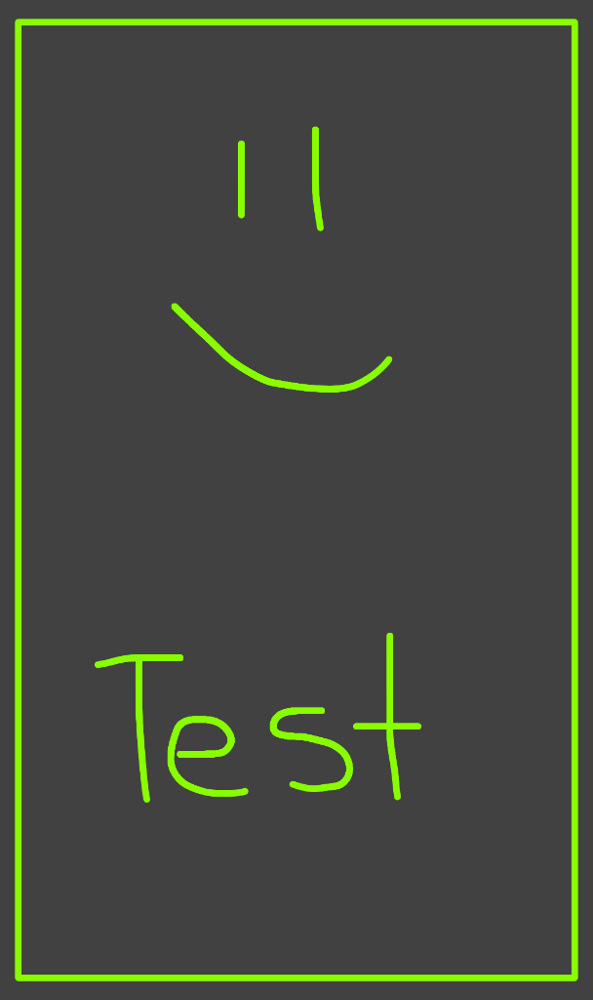

# MiniPaint

Drawing on Canvas Objects  
Lesson 4 of [Advanced Android with Kotlin course on Udacity](https://classroom.udacity.com/courses/ud940)

## Introduction

This app uses a custom view to implement drawing on a canvas in response to touch events. All drawing happens on the UI thread by overriding the custom view's onDraw() method. You can use this technique when drawing always takes less time than a screen refresh cycle on all target devices.

Tasks:

* Create a custom view for drawing
* Display the Canvas
* Set up a Paint and a Path for Drawing
* Draw following the user's touch
* Draw a frame around the sketch

## Screenshots

